---

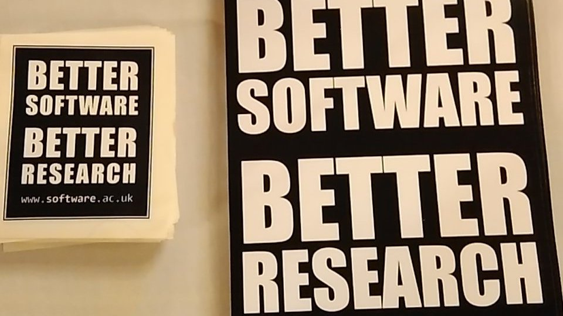

# Happy Coder. Better Research.

---

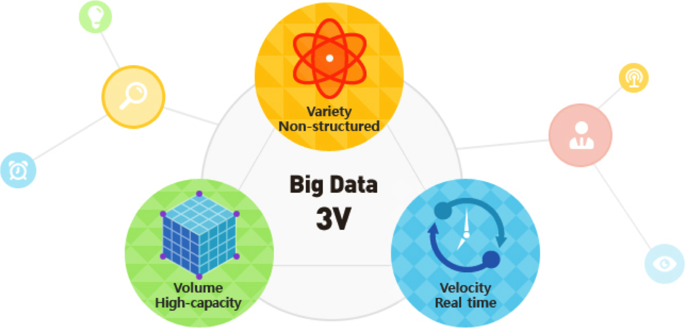

Data production is no longer the bottleneck.

We can collect and analyze data that gives us information and
insight in a way we never could before. It opens up possibilities
for the types of work we can do and questions we can ask.

## {.flexbox .vcenter}

Software and tools allow us to turn data into information.

We put a lot of emphasis on the development of tools and approaches, and rightfully so. These tools help us get to the 'now what' and turn data into information. Grants and VCs support this work
that give us a new view of the data or a way to use it.

## {.flexbox .vcenter}

People turn information into knowledge.

It is not the tools that do the work to turn data into knowledge
or make the discoveries. People are the ones who turn information
into knowledge.

## {.flexbox .vcenter}

By making data accessible and putting the data skills and the perspectives in the hands of all researchers, we allow them to answer their own questions and capture their passion and expert knowledge.

When we limit the number or types of people who
do this work, we're losing that curiousity, that drive, that
expert knowledge.

Story about person. Who better to do or be a part of the analysis
of the ... gemone than the person who has spent their entire
career working on it. If they hand it to me, I'm not as movitated,
 and I might not even get it right.

# How do we scale data and software skills and literacy along with data production?

# Training

## Researchers want training

Most useful thing Bioinformatics Resource Australia can do

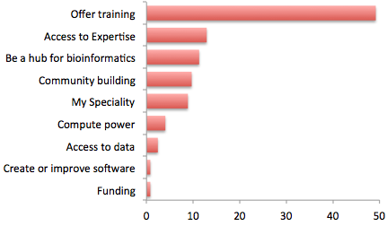

[BRAEMBL community survey report](http://braembl.org.au/news/braembl-community-survey-report-2013)

## How do we provide training? {.flexbox .vcenter}

- Training in the gaps
- Scaling curriculum and instructors
- Friendly learning environment

# Training in the Gaps

## Training active researchers

Active researchers and employees are learning these skills "on the job".

Need to develop and deliver training that fits their time and needs.

> - Training that is immediate, accessible, appropriate for their level and relevant to their domain.
> - Include not only technical skills, but also ways of thinking about data and knowing what's possible
> - Opportunity for deliberate practice, hands-on training with feedback during learning
> - Researchers need to build confidence and the belief that they are capable of computational work, self-efficacy

No time or focus for semester courses or even MOOCs

Need to develop and deliver training that fits in their time and attention.

- Researchers need training that is immediate, accessible, appropriate for their level and relevant to their domain.
- Training needs to include not only technical skills, but also ways of thinking about data and knowing what's possible
- Learning is improved through deliberate practice, hands-on training with feedback during learning
- Researchers need to build confidence and the belief that they are capable of computational work, self-efficacy

## Software Carpentry and Data Carpentry

Community organizations training researchers in best practices for data analysis and software development to make research more effective and reproducible. 

- Core skills for effective research computing
- Two-day hands-on workshops
- Collaboratively developed, openly licensed lesson materials
- Over 700 trained volunteer instructors on 6 continents 

## How we teach: Hands on intensive workshops

- Short: Two days
- Impactful: Focused time
- Convenient: Held at the university or organization
- Interactive: Hands-on teaching and exercises
- Immediate feedback: sticky notes & minute cards
- Qualified instructors
- Shared learning and a friendly learning environment

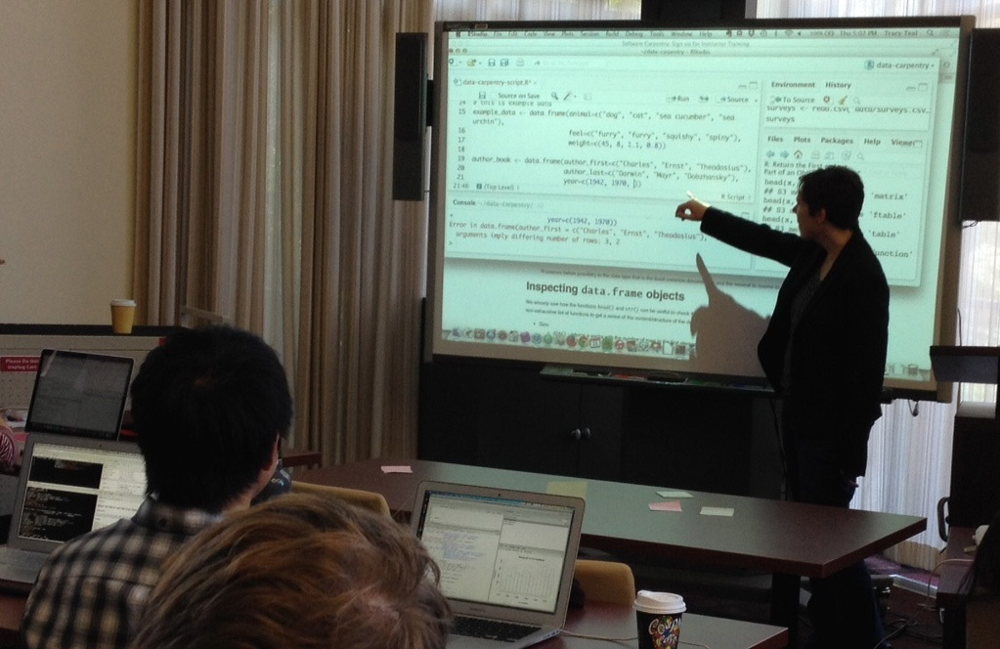

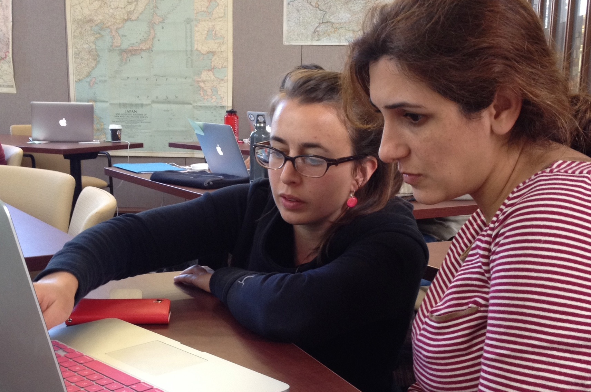

## What we teach

Foundational skills needed to effectively conduct computational research.

**Software Carpentry**
Domain-agnostic and focused on better coding practices.

**Data Carpentry**  
Domain specific and focused on how to work effectively with data.

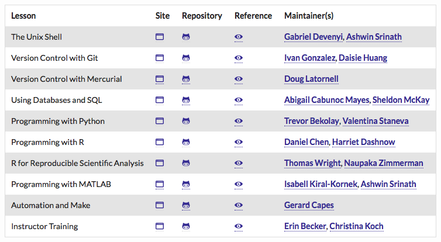

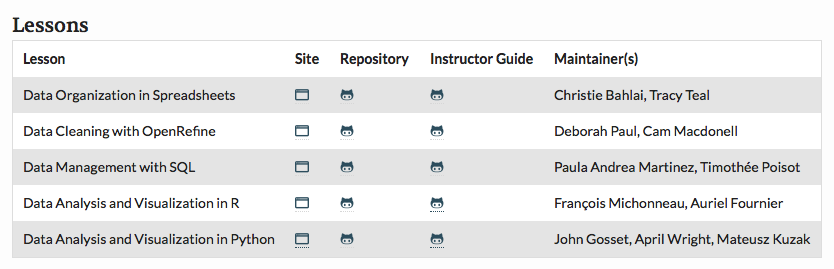

## People are learning the skills

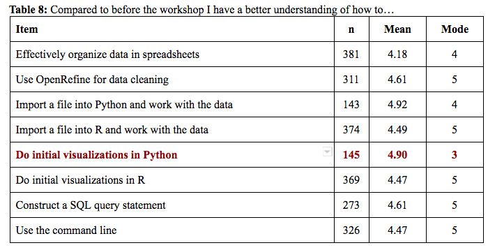

## Skills are practical & workshops worth their time

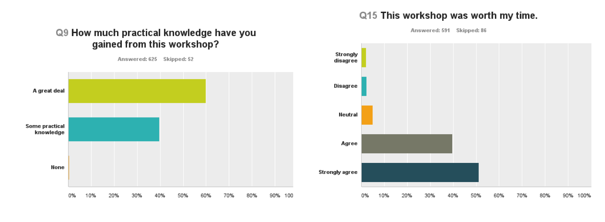

# Scaling curriculum and instructors

## Sharing curriculum and creating instructors

- **Collaboratively developed, openly accessible lessons**

  - http://www.software-carpentry.org/lessons  
  - http://www.datacarpentry.org/lessons

- **Instructor training program**

## {.flexbox .vcenter}

Since 2015

- 690 workshops
- 14,642 learners
- 6 continents

# Friendly learning environment

## Need confidence to continue learning

- Meeting learners where they are
- Code of conduct

## Learners feel they can apply what they learned

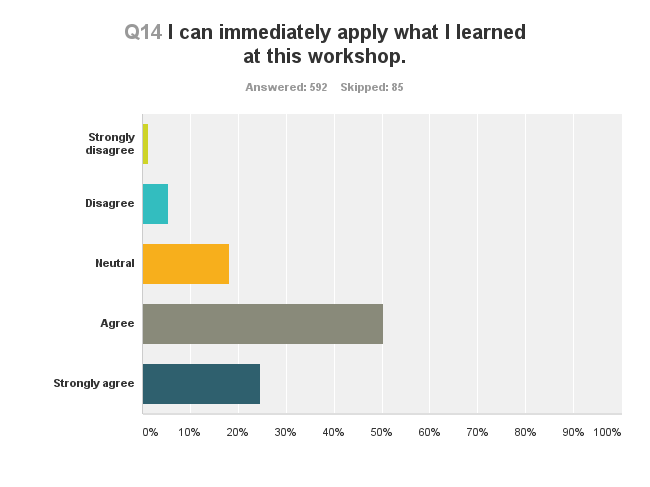

## Would recommend the workshop to a colleague or friend

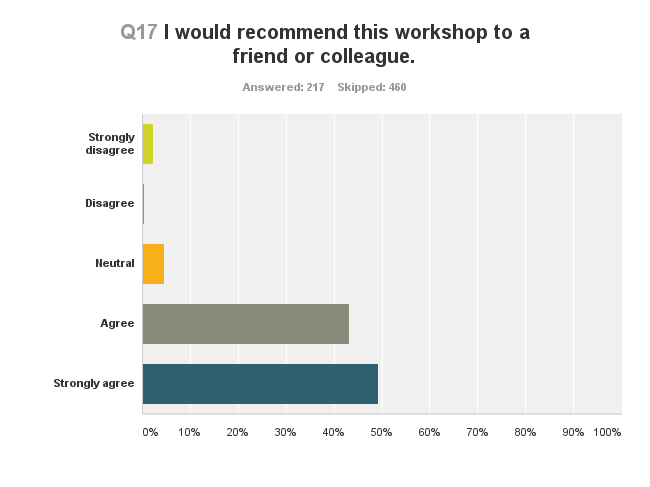

# {.centered}
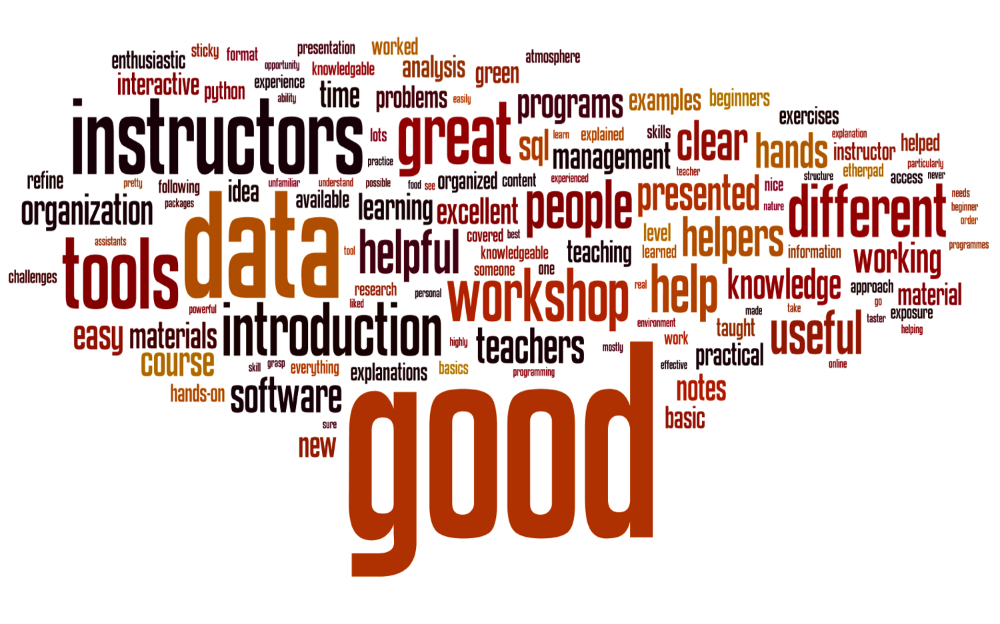

## How can you or your organization be involved

- Request a workshop
- Become a Partner and build local training capacity
- Become an instructor or help at a workshop
- Contribute to lessons
- Join our 'announce' list to be a part of the community
- Be an advocate for training initiatives & opportunities

## Acknowledgements

- Over 700 volunteers worldwide that teach and develop lessons
- Greg Wilson, who founded Software Carpentry
- The Steering Committees of Software and Data Carpentry (Karthik Ram and Ethan White)
- Software and Data Carpentry staff: Jonah Duckles, Greg Wilson, Erin Becker, Maneesha Sane and Kari Jordan

## Acknowledgements
- Gordon and Betty Moore Foundation
- National Science Foundation BIO Centers: iDigBio, CyVerse, NESCent, SESYNC, BEACON, NEON

# Happy Coders. Better Software. Better Research.

---

## {.flexbox .vcenter}

